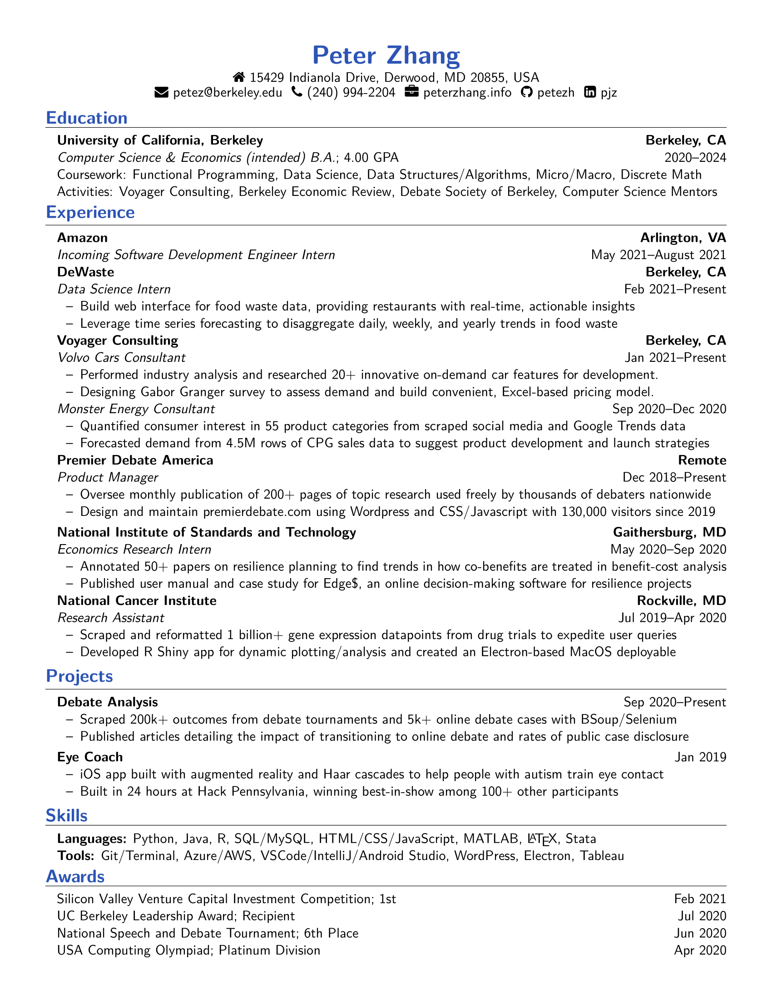

# Resume Template

#### Resumes

Here are the versions of my resume and their associated Latex templates. They are categorized by general industry (SWE = software engineering, DS = data science). Folders are helpful for separating different versions, and GitHub lets me easily keep track of all past versions without cluttering up the repo.

#### Template

Feel free to use my template if you like it. Some features that recommend my version are:

- **Compact format** lets you fit lots of content
- Headers and sub-headers are **customizable** for your needs
- **Icon**-filled personal information section, with **URLs** to your GitHub, website, etc.
- **ATS-friendly** formatting
- Design flexibility: colors, font, ordering, etc.

>  Be sure to use **LuaLaTeX** if you plan on using the icons. Otherwise, you can take them out and use any Latex typesetting system.

#### Contact

Feel free to reach out to me on [Facebook](https://www.facebook.com/petejzh/) or at [petez@berkeley.edu](mailto:petez@berkeley.edu) for questions!
